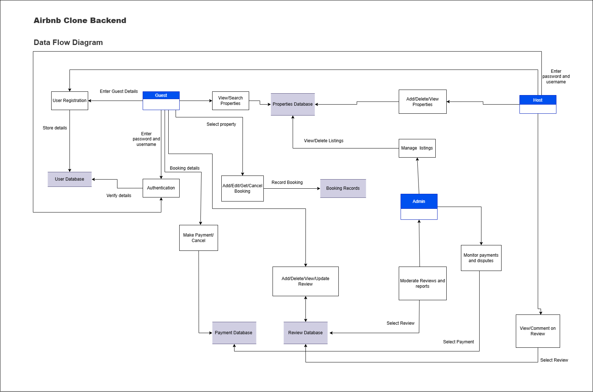

## 📊 Data Flow Diagram

This is a Level 1 DFD to represent the flow of data between key components of the Airbnb Clone backend system.

---

Actors:

- Guest
- Host
- Admin

Processes:

- User Authentication
- Property Management
- Booking System
- Payment Processing
- Review & Rating System
- Admin Management

Data Stores:

- Users DB
- Properties DB
- Bookings DB
- Payments DB
- Reviews DB

---

### 📥 Data Flow Details

---

## _Data flow diagram_

📝 This DFD illustrates the logical movement of data between actors, backend processes, and storage systems in a structured UML-inspired format.
