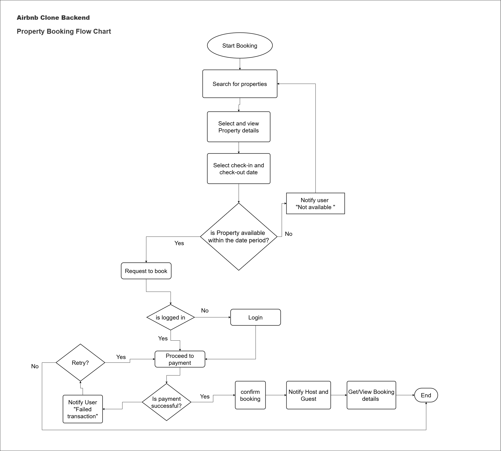

## Property Booking Flow Summary

The property booking process guides a guest user through several steps to ensure a smooth and secure transaction. Below is a high-level overview of the flow:

1. **Property Search**: Guest searches for available properties.
2. **Property Selection**: Guest selects and views details of a property.
3. **Date Selection**: Guest selects preferred check-in and check-out dates.
4. **Availability Check**: System checks if the property is available for those dates.
   - If **unavailable**, user is notified.
   - If **available**, the user proceeds.
5. **User Authentication**:
   - If the user is **not logged in**, they are prompted to log in.
   - If **logged in**, the process continues.
6. **Payment**:
   - Guest proceeds to payment.
   - If payment is **successful**, booking is confirmed.
   - If **failed**, user is notified.
7. **Confirmation**:
   - Both guest and host receive notifications.
8. **Booking Status**: Guest can view booking status and details in their dashboard.

---

## Flow Diagram

Visual representation of the full property booking logic:

---
